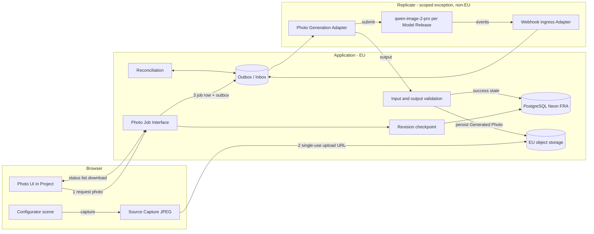
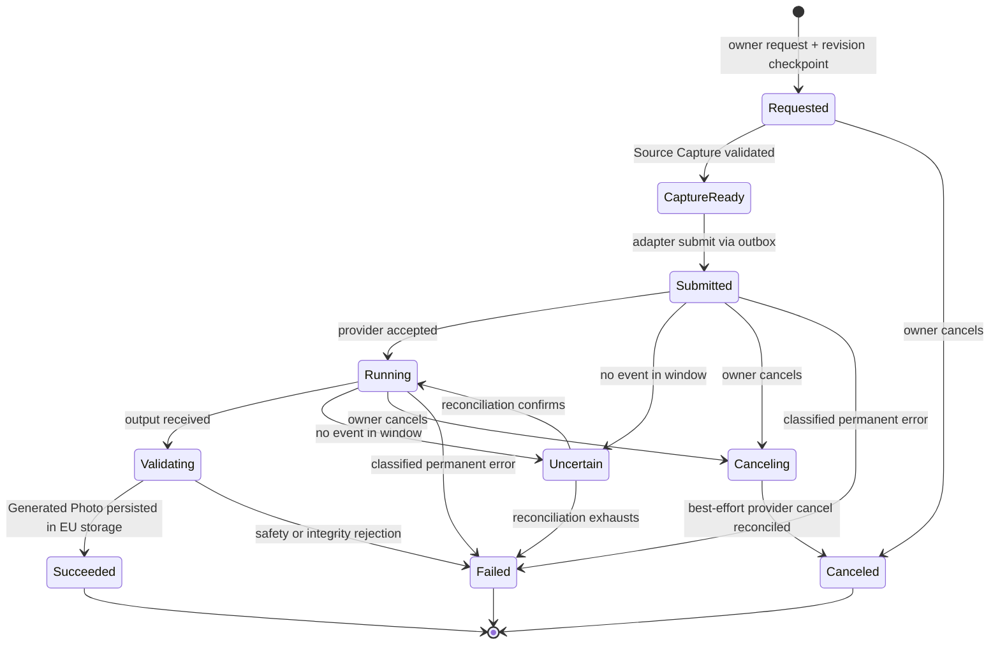
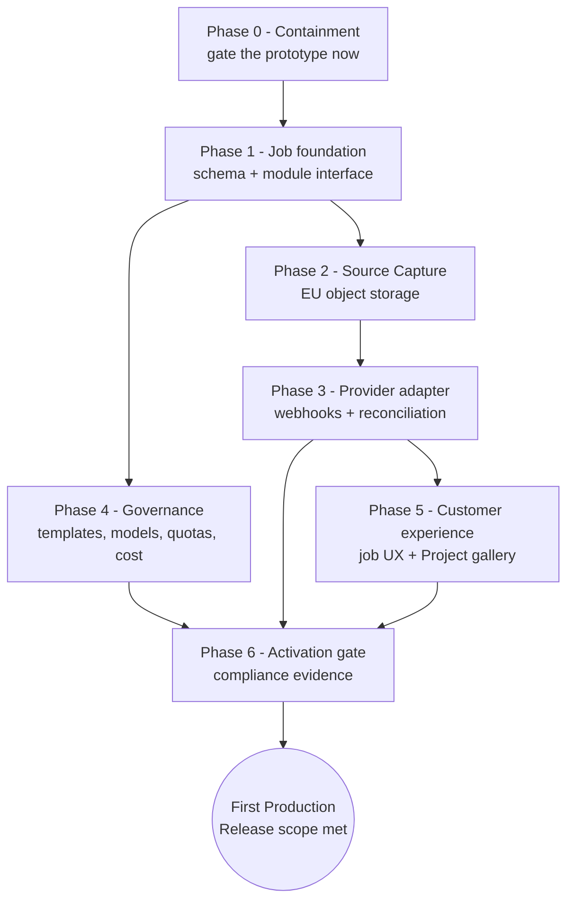

# AI Photo — Revised Implementation Plan (v2)

| | |
| --- | --- |
| Status | Active plan — supersedes PLAN.md v1 (2026-07-02) |
| Revised | 2026-08-27 |
| Working branch | `redesign/devstart` |
| Governing decisions | [ADR 0008](DOCS/adr/0008-keep-photo-jobs-application-owned-with-replicate-exception.md), [ADR 0003](DOCS/adr/0003-separate-working-configuration-from-revisions.md), [ADR 0004](DOCS/adr/0004-use-portable-sql-on-neon-frankfurt.md), [CONTEXT.md](CONTEXT.md) domain language |
| Scope | Take the working AI-photo prototype to the Photo Job Module required for the First Production Release |

## 1. Where we stand

### 1.1 What the prototype proved (v1 plan: delivered)

The v1 plan was fully implemented and survived the Galerie redesign and the
path-tracing renderer upgrade:

- **Capture** — the live WebGL frame (AO, tone mapping) is captured via
  `preserveDrawingBuffer` + capture bridge, center-cropped to 1280×720 JPEG
  under Replicate's data-URI limit
  (`features/configurator/photo/use-scene-capture.ts`).
- **Generation** — `POST /api/photo` builds the prompt server-side from the
  configured finishes plus a selected preset and calls
  `qwen/qwen-image-2-pro` (16:9) synchronously
  (`app/api/photo/route.ts`).
- **Presentation** — popover with 4 preset chips, progress shimmer, result
  with download/regenerate, clean error states
  (`features/configurator/photo/photo-popover.tsx`).
- `REPLICATE_API_TOKEN` is configured locally.

**The prototype's job was to answer "does screenshot → qwen produce a
convincing kitchen photo, and does the UX feel right?" — it has served that
purpose.** Everything below is about what it deliberately is *not*.

### 1.2 What the platform now provides (built since v1)

The account and persistence foundation that v1 lacked now exists and changes
the cost of every next step:

- **Customer Accounts** — Better Auth email-code sign-in, server-side
  session resolution (`lib/server/auth/`), ADR 0001/0002.
- **Project Module** — PostgreSQL on Neon Frankfurt (ADR 0004), Working
  Configuration autosave with optimistic concurrency, immutable
  Configuration Revisions, version history and restore
  (`lib/server/projects/`, `features/projects/`).
- **Revision triggers** — the `configuration_revision.trigger` constraint
  already admits `'photo'`: the data model anticipates photo-triggered
  checkpoints. Nothing writes them yet.
- **Sharing** — hash-secret Shared Revision Links with a fail-closed public
  resolver that deliberately exposes **no AI-photo action** (CONTEXT.md,
  Shared Revision View).
- **Test discipline** — unit + DB integration suites, lint/build gates,
  reconciled STATUS.md.

### 1.3 What does not exist yet

- No EU object storage (Source Captures and Generated Photos have nowhere
  durable to live).
- No Photo Job table, module interface, webhook ingress, or reconciliation.
- No Prompt Template Release or Model Release records.
- No quotas, budgets, or cost evidence.
- No approved Replicate DPA/transfer-mechanism evidence (the ADR 0008
  exception is **not yet activated**).

## 2. Critical assessment — prototype vs. ADR 0008

ADR 0008 (accepted) explicitly replaces "the synchronous, browser-memory-only
Replicate prototype" with an application-owned Photo Job Module. The current
route must therefore be treated as **development scaffolding, not a
production candidate**. The gaps, precisely:

| # | Prototype behavior today | ADR 0008 / Release requirement | Severity |
| --- | --- | --- | --- |
| G1 | `POST /api/photo` is unauthenticated; anyone reaching it spends Replicate credits | Only the Project owner may request a Photo Job | **Blocker** |
| G2 | Synchronous request; result lives only in browser memory | Photo Job survives browser closure; success only after output is persisted | **Blocker** |
| G3 | No persistence; Generated Photo is an ephemeral data URL | Generated Photo stored in application-owned EU object storage, tied to its Configuration Revision | **Blocker** |
| G4 | Capture accepted inline from the browser without validation | Source Capture uploaded via single-use URL to EU storage, validated as untrusted input | **Blocker** |
| G5 | No revision checkpoint; photo is generated from whatever the canvas shows | Request atomically checkpoints the Working Configuration into a Configuration Revision first | **Blocker** |
| G6 | Prompt assembled ad hoc in code; model referenced unversioned | Every production execution uses approved immutable Prompt Template Release + Model Release | High |
| G7 | No quotas or budgets | Customer quotas and provider-wide budgets independently enforced | High |
| G8 | No cost/provenance evidence per attempt | Each provider attempt preserves operational, provenance, and cost evidence | High |
| G9 | US processing without executed DPA/transfer mechanism | Replicate activation requires the full ADR 0008 evidence list | **Blocker (compliance)** |
| G10 | No output safety/moderation validation | Validated output with safety and configuration-integrity checks before success | High |
| G11 | No kill switch | Verified kill-switch control; withdrawal disables new generation gracefully | High |

**Consequence:** the prototype route must not be reachable in any production
deployment. Phase 0 below contains it immediately; the target module then
replaces it. Nothing in this plan weakens the EU-residency rule for
accounts, projects, or application storage.

## 3. Target architecture (per ADR 0008)

Key properties: provider types and URLs never leak past the Adapter; the job
is durable before any provider call; success is declared only after the
validated Generated Photo is in EU storage; reconciliation — not hope —
handles missing, duplicate, and out-of-order provider events.

## 4. Photo Job lifecycle

Automatic retry applies only to failures classified transient, inside the
job, never by re-submitting a new job silently.

## 5. Path forward — phases

### Phase 0 — Containment (immediate, ~½ day)

The only phase that touches the prototype route.

- [ ] Require an authenticated Customer Session on `POST /api/photo`
      (reuse `lib/server/auth/customer-session.ts`).
- [ ] Add `PHOTO_PROTOTYPE_ENABLED` env flag, default **off**; the route
      404s when off. This is the interim kill switch (G11 partial, G1).
- [ ] Never expose the route on any public deployment while this plan runs.

*Exit:* unauthenticated or flag-off requests cannot spend provider credits.

### Phase 1 — Photo Job foundation (~2–3 days)

- [ ] Migrations: `photo_job`, `generated_photo`, `source_capture` tables —
      owner-scoped, referencing `configuration_revision`; job state enum per
      §4; provider fields internal and nullable.
- [ ] `lib/server/photo-jobs/` module with the small Interface from ADR
      0008: request, status, list-for-project, cancel. Same seam style as
      `lib/server/projects/`.
- [ ] Request path checkpoints the Working Configuration into a
      Configuration Revision (`trigger = 'photo'`) atomically with job
      creation (G5), with expected-version concurrency like autosave.
- [ ] DB integration tests: idempotent request, owner scoping, state
      transitions, checkpoint atomicity.

*Exit:* a Photo Job can be created, listed, and canceled durably — with no
provider call yet.

### Phase 2 — Source Capture pipeline (~2 days)

- [ ] Select EU object storage (EU region bucket consistent with ADR 0004's
      Frankfurt posture; document choice in a new ADR).
- [ ] Single-use, size- and content-type-bound upload URLs issued by the
      module; captures validated server-side (decode, dimensions, byte
      limit) before a job may proceed (G4).
- [ ] Retention rule for captures documented and enforced (delete after job
      terminal state + grace window).

*Exit:* captures live in EU storage; nothing is accepted inline anymore.

### Phase 3 — Provider adapter, webhooks, reconciliation (~3–4 days)

- [ ] `PhotoGenerationAdapter` for Replicate using **predictions + webhook**
      (not blocking `run()`): submit, get, best-effort cancel. Provider
      identifiers stay internal (G2).
- [ ] Webhook ingress route with signature verification; events land in an
      idempotent inbox keyed by provider event id.
- [ ] Outbox worker + scheduled reconciliation sweep for `Uncertain` jobs
      (missing/duplicated/out-of-order events).
- [ ] Output validation before success: decode, dimension check, basic
      safety/moderation gate (G10); persist Generated Photo to EU storage,
      then — and only then — mark `Succeeded` (G3).
- [ ] Provider attempt evidence rows: timestamps, model identifier,
      estimated vs reconciled cost (G8, foundation for Phase 4).

*Exit:* browser closure mid-generation loses nothing; a killed webhook is
recovered by reconciliation; success implies a durable EU-stored photo.

### Phase 4 — Governance: templates, models, quotas, budgets (~2–3 days)

- [ ] `prompt_template_release` and `model_release` records (immutable rows,
      approved-by/at); jobs pin both (G6). Current in-code template becomes
      Release v1; current presets become approved Scene Presets.
- [ ] Prompt assembly takes product facts from the pinned revision's
      product-definition snapshot — never from client input.
- [ ] Per-customer quota (e.g. N jobs per rolling 24 h) and provider-wide
      budget breaker, independently enforced in the module (G7).
- [ ] Kill switch: module-level flag that stops new submissions while
      status/list/cancel keep working (G11).

*Exit:* every execution is attributable to an approved template + model, and
spend is bounded even under abuse or provider misbehavior.

### Phase 5 — Customer experience (~3 days)

- [ ] Rework the popover flow onto the job API: request → async progress
      (poll or SSE) → result; closing the popover no longer abandons work.
- [ ] Photos live with the Project: gallery of Generated Photos per
      Configuration Revision in the account workspace, with download and
      delete.
- [ ] Photo actions appear only for the owner of an active saved Project —
      guest configurations prompt "Als Projekt speichern" first (matches
      ADR 0008 ownership rule; shared views stay photo-free per CONTEXT.md).
- [ ] Illustrative-image disclosure copy on every Generated Photo surface
      ("kann keine Produktwahrheit begründen").
- [ ] E2E coverage of request→succeed and request→close-browser→revisit.

*Exit:* the feature is a durable Project capability, not a popover trick.

### Phase 6 — Production activation gate (calendar-driven, not code-driven)

Per ADR 0008, **new generation stays disabled in production** until each item
holds evidence; a Release Owner signs the gate:

- [ ] Executed, approved Replicate DPA + transfer mechanism (G9).
- [ ] Current subprocessor + retention review on file.
- [ ] Customer disclosure + lawful basis approved (privacy text live).
- [ ] Exact model/license approval recorded as the active Model Release.
- [ ] Least-data configuration verified (no PII in prompts or captures).
- [ ] Webhook, reconciliation, cancellation, moderation, cost, deletion,
      and kill-switch controls demonstrated in QA.
- [ ] Withdrawal drill: flag off → existing jobs still reconcile and delete.

*Exit:* the ADR 0008 exception is activated — or the feature ships dark.

## 6. Risk register

| Risk | Likelihood | Impact | Mitigation |
| --- | --- | --- | --- |
| Prototype route reached in production before containment | Medium | Uncontrolled spend, compliance exposure | Phase 0 this week; flag defaults off |
| Replicate DPA/transfer evidence not obtainable | Medium | Feature cannot activate | Adapter seam preserves exit path; evaluate EU-hostable alternative behind same Interface |
| Webhook delivery gaps | High (expected) | Stuck jobs | Inbox idempotency + scheduled reconciliation are first-class in Phase 3, not an afterthought |
| Cost overrun via retries/abuse | Medium | Budget damage | Quotas + budget breaker (Phase 4) before any public exposure |
| Generated image implies false product truth | Medium | Commercial/legal exposure | Disclosure copy (Phase 5); prompts built only from pinned Release facts |
| Browser capture manipulated | Low–Medium | Off-brand/abusive outputs | Capture validation (Phase 2), output moderation (Phase 3), audit trail |
| Storage choice conflicts with residency posture | Low | Rework | Decide via ADR in Phase 2 before code depends on it |

## 7. Explicitly out of scope (this plan)

- Public/shared-view photo actions (excluded by CONTEXT.md by design).
- Deterministic server-side renderer for Source Captures (future swap the
  Module Interface already anticipates).
- Quote Request attachment of Generated Photos, upscaling, multi-image
  batches, and any commerce linkage.

## 8. Prototype traceability

| Prototype artifact | Disposition |
| --- | --- |
| `app/api/photo/route.ts` | Phase 0: gated. Retired when Phase 5 lands; capture-size validation logic migrates into Source Capture validation |
| `use-scene-capture.ts` | Kept — becomes the Source Capture producer feeding upload URLs |
| `photo-presets.ts` | Content promoted into approved Scene Presets + Prompt Template Release v1 (Phase 4) |
| `photo-popover.tsx` | Reworked onto the job API in Phase 5; visual design retained |
| v1 PLAN.md hardening checklist | Superseded — every item maps into Phases 0–6 above |

---

*Estimates are engineering-effort only and exclude Phase 6 lead times
(legal/DPA review is calendar time). STATUS.md should be reconciled when
each phase lands.*
